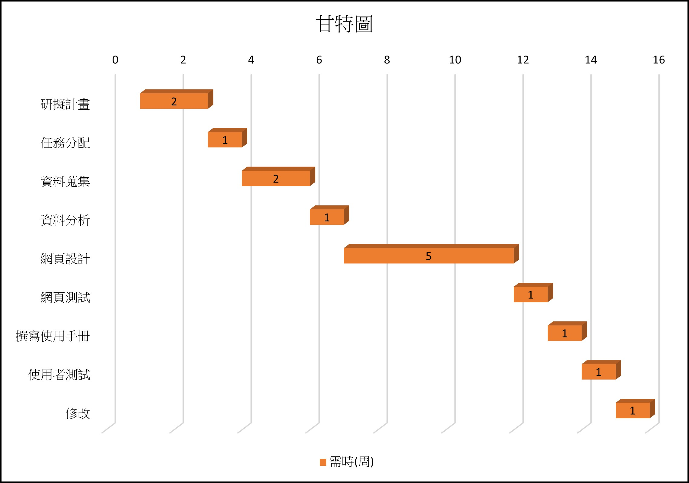

#### 組長:黃琬茲
##### 組員:朱桂玉、賴宇璇、潘珈君
#### 任務分配: 
##### 甘特圖（宇璇）
##### 關鍵路徑（琬茲）
##### 資料搜集（全部人excel檔）
##### 資料分析（琬茲）
##### 程式開發（全部人）
##### 程式測試（全部人）
##### 撰寫使用手冊（全部人）
##### 使用者測試（全部人）
##### 程式維護（全部人）
### 專題題目:書店訂購系統
#### 內容:利用Python設計出訂購系統，了解系統的運作與分析

### 甘特圖

### PERT/CPM 圖

