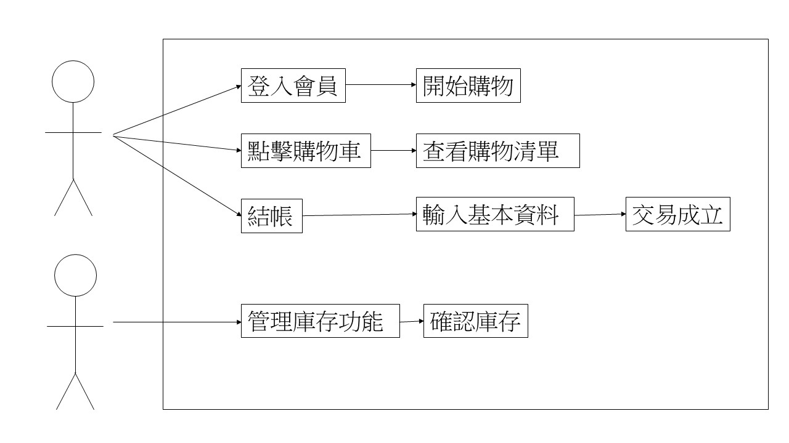

#### 組長:黃琬茲
##### 組員:朱桂玉、賴宇璇、潘珈君
#### 任務分配: 
##### 甘特圖（宇璇）
##### 關鍵路徑（琬茲）
##### 資料搜集（全部人excel檔）
##### 資料分析（琬茲）
##### 程式開發（全部人）
##### 程式測試（全部人）
##### 撰寫使用手冊（全部人）
##### 使用者測試（全部人）
##### 程式維護（全部人）
### 專題題目:書店訂購系統
#### 內容:利用Python設計出訂購系統，了解系統的運作與分析

### 甘特圖

### PERT/CPM 圖

| 功能性需求     |     |
| :------------   |:-------|
| 登入 | 顧客&管理者可以輸入帳號密碼登入 |
| 訂購 | 顧客可以選擇加入商品進行購物車結帳 |
| 庫存管理 | 管理者可以管理所有商品的數量 |
| 用戶管理 | 管理者可以管理所有顧客的資料 |

|     非功能性需求  |     |
| :------------    |:----|
| 反應時間    | 對於使用者所觸發之事件的執行所將花費之時間 |
| 維護性    | 描述任何可以增進系統維護之相關項目，例如編碼的準則，命名的標準等 |
| 可擴展性        | 指一個軟體和系統能夠讓其他程序員在未來能增加新的功能以及修改現有功能,並且新增功能的同時遗必須不害現有系統或軟體功能 |

### 功能分解圖

### 需求分析

### 使用案例圖

|   使用案例分析   |  登入系統   |
| :--------|:-------|
| 行動者  | 顧客  |
| 說明 |  輸入帳號密碼登入系統 |
| 完成動作 | 顧客輸入帳號、顧客輸入密碼、顧客點擊登入、系統顯示成功登入 |
| 替代動作 | 顧客輸入帳號、顧客輸入密碼、顧客點擊登入、系統顯示無法登入 |
| 先決條件  |  帳號與密碼不可空白 |
| 後置條件 | 登入成功才可選購商品 |
| 假設 | 無 |

