#### 組長:黃琬茲
##### 組員:朱桂玉、賴宇璇、潘珈君
#### 任務分配: 
##### 甘特圖（宇璇）
##### 關鍵路徑（琬茲）
##### 資料搜集（珈君）
##### 資料分析（琬茲）
##### 程式開發（琬茲）
##### 程式測試（桂玉）
##### 撰寫使用手冊（宇璇）
##### 使用者測試（珈君）
##### 程式維護（桂玉）
### 專題題目:書店訂購系統
#### 內容:設計出訂購系統，了解系統的運作與分析

### 甘特圖

### PERT/CPM 圖
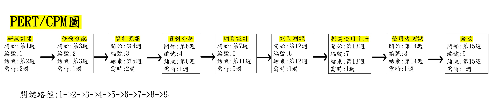

| 功能性需求     |     |
| :------------   |:-------|
| 登入 | 顧客&管理者可以輸入帳號密碼登入 |
| 訂購 | 顧客可以選擇加入商品進行購物車結帳 |
| 庫存管理 | 管理者可以管理所有商品的數量 |
| 用戶管理 | 管理者可以管理所有顧客的資料 |

|     非功能性需求  |     |
| :------------    |:----|
| 反應時間    | 對於使用者所觸發之事件的執行所將0.5秒時間 |
| 維護性    | 可以維護商品的庫存管理 |
| 可擴展性        | 可以讓管理員新增商品與功能以及修改現有商品或功能內容 |

### 功能分解圖
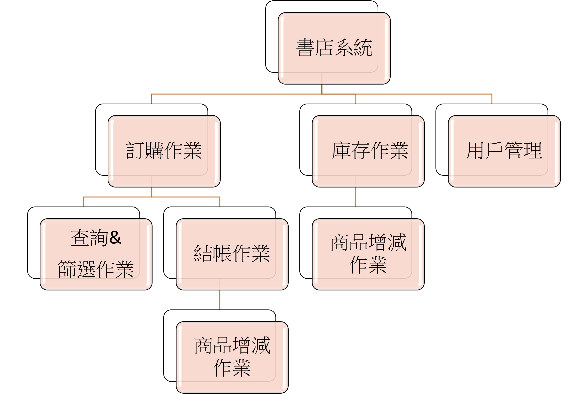

### 需求分析
1.	顧客可藉由登入系統來開始購物
2.	顧客可藉由點擊結帳功能來輸入基本資料以成立交易
3.	管理者可藉由管理庫存功能來確認庫存數量

### 使用案例圖
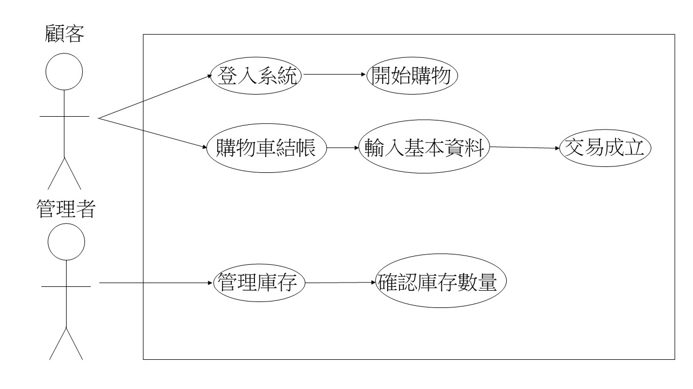

|   使用案例分析   |  登入系統   |
| :--------|:-------|
| 行動者  | 顧客  |
| 說明 |  輸入帳號密碼登入系統 |
| 完成動作 | 顧客輸入帳號、顧客輸入密碼、顧客點擊登入、系統顯示成功登入 |
| 替代動作 | 顧客輸入帳號、顧客輸入密碼、顧客點擊登入、系統顯示無法登入 |
| 先決條件  |  帳號與密碼不可空白 |
| 後置條件 | 登入成功才可選購商品 |
| 假設 | 無 |

|   使用案例分析   |  購物車結帳  |
| :--------|:-------|
| 行動者  | 顧客  |
| 說明 |  購買商品 |
| 完成動作 | 顧客按購物車、輸入完畢基本資料、系統顯示交易成功 |
| 替代動作 | 顧客按購物車、基本資料未輸入完整、系統顯示交易不成立 |
| 先決條件  |  購物車內必須至少有一項商品 |
| 後置條件 | 交易成立，可以繼續查看其他商品 |
| 假設 | 無 |

|   使用案例分析   |  管理庫存   |
| :--------|:-------|
| 行動者  | 管理者  |
| 說明 |  管理者確認庫存數量 |
| 完成動作 | 管理者選擇商品、更改庫存數量整數、管理者保存數量、系統跳出成功 |
| 替代動作 | 管理者選擇商品、更改庫存數量非整數、管理者保存、系統跳出數量錯誤 |
| 先決條件  |  無 |
| 後置條件 | 成功後可以回到庫存頁更改其他商品 |
| 假設 | 無 |

#### Figma 設計圖
[Figma](https://www.figma.com/proto/rrU6Kj7jmiKSfxfNsO9LAB/Untitled?node-id=1%3A3&scaling=scale-down&page-id=0%3A1&starting-point-node-id=1%3A3)

#### DFD 設計圖
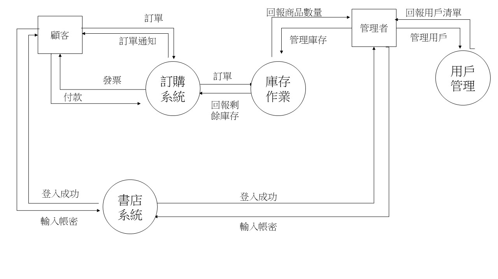

#### DFD 圖0 設計圖1
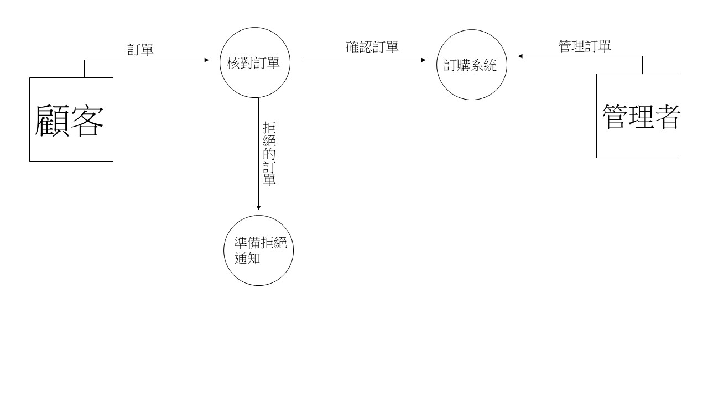

#### DFD 圖0 設計圖2
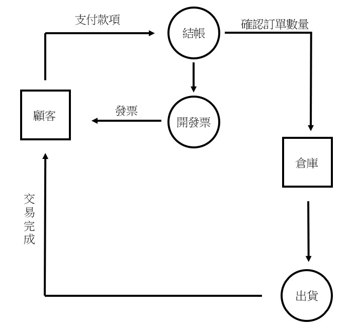

#### DFD 圖0 設計圖3
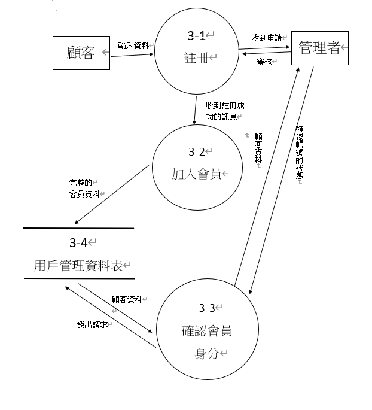

#### UML
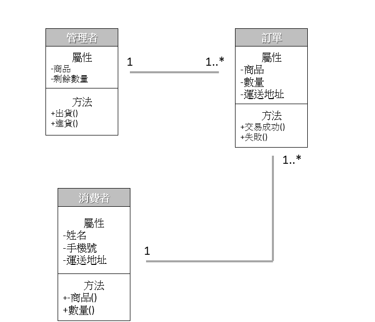

#### 登入系統 活動圖
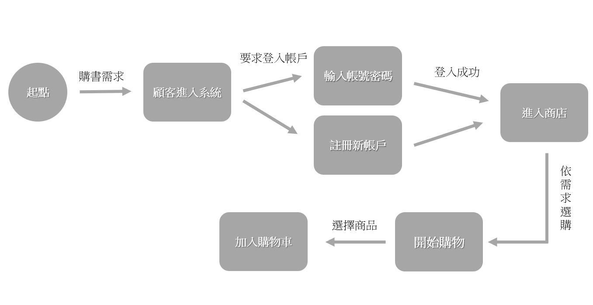

#### 購物車結帳 活動圖
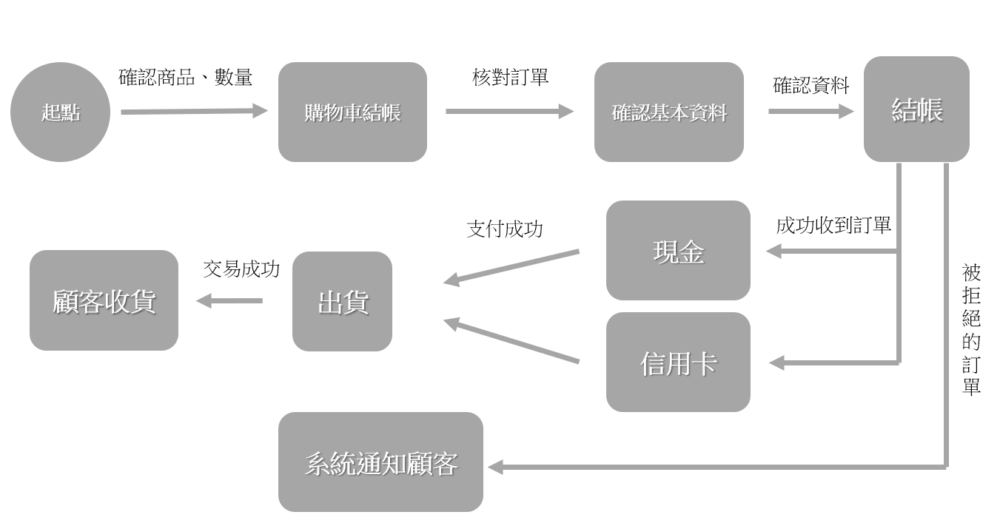

#### 管理庫存 活動圖
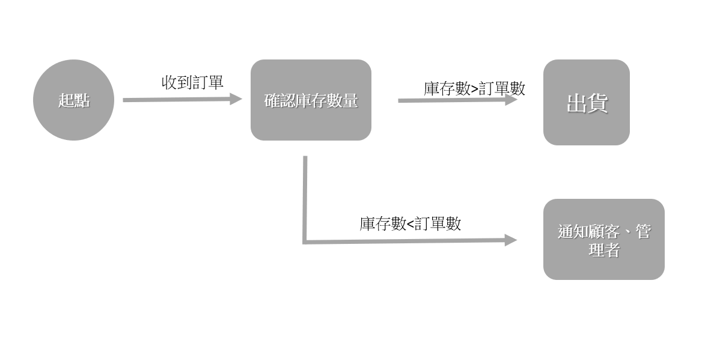

#### 登入系統 循序圖
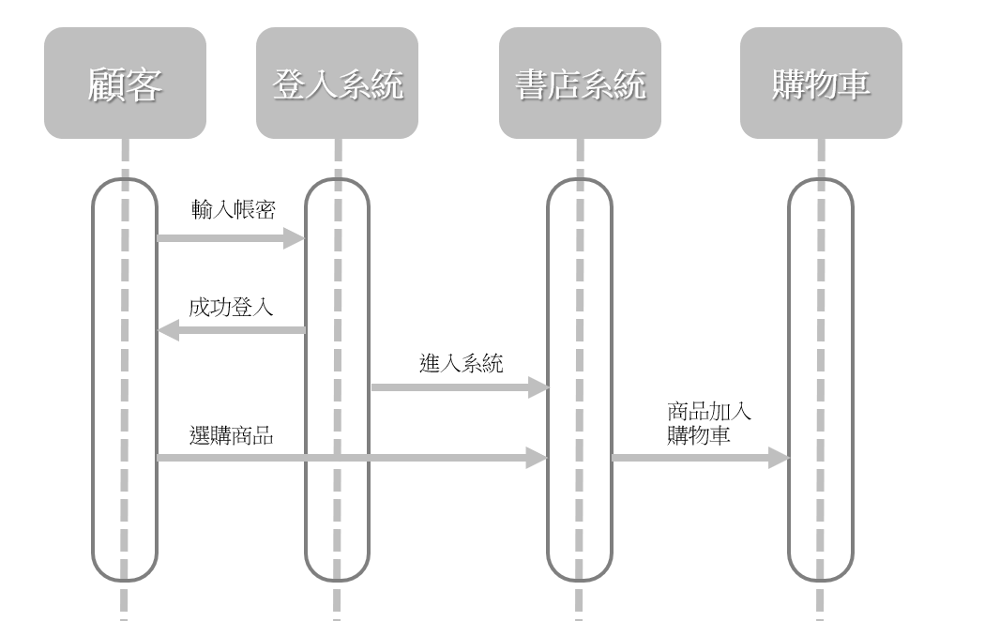

#### 購物車結帳 循序圖
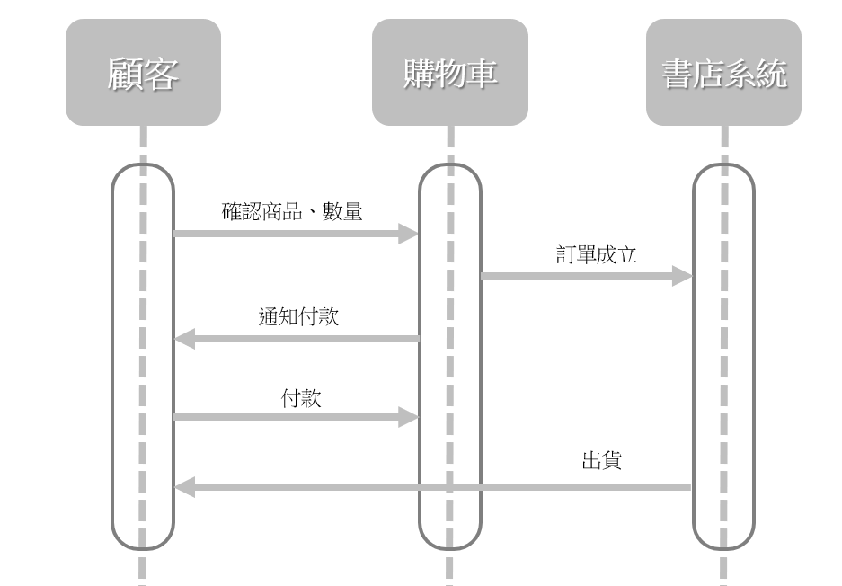

#### 管理庫存 循序圖
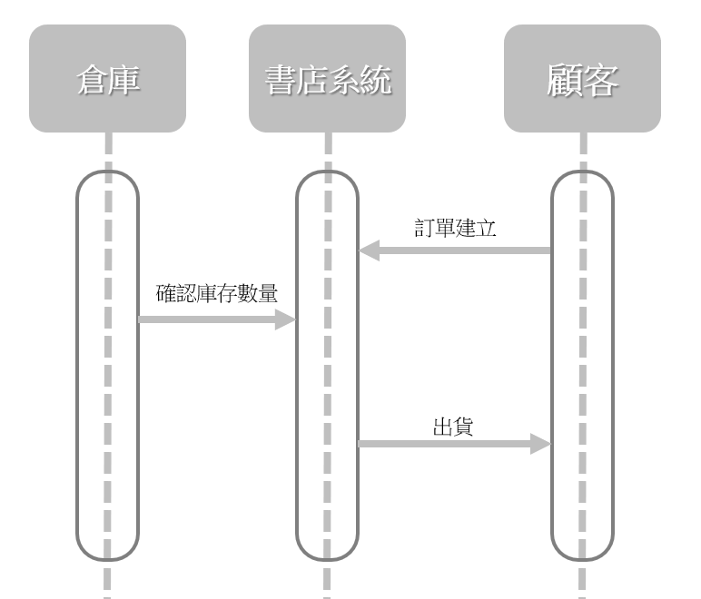

#### Figma 畫面設計
[Figma](https://www.figma.com/proto/rrU6Kj7jmiKSfxfNsO9LAB/Untitled?node-id=1%3A3&scaling=scale-down&page-id=0%3A1&starting-point-node-id=1%3A3)
